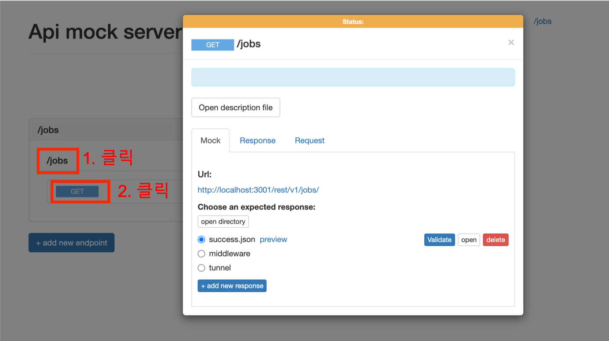
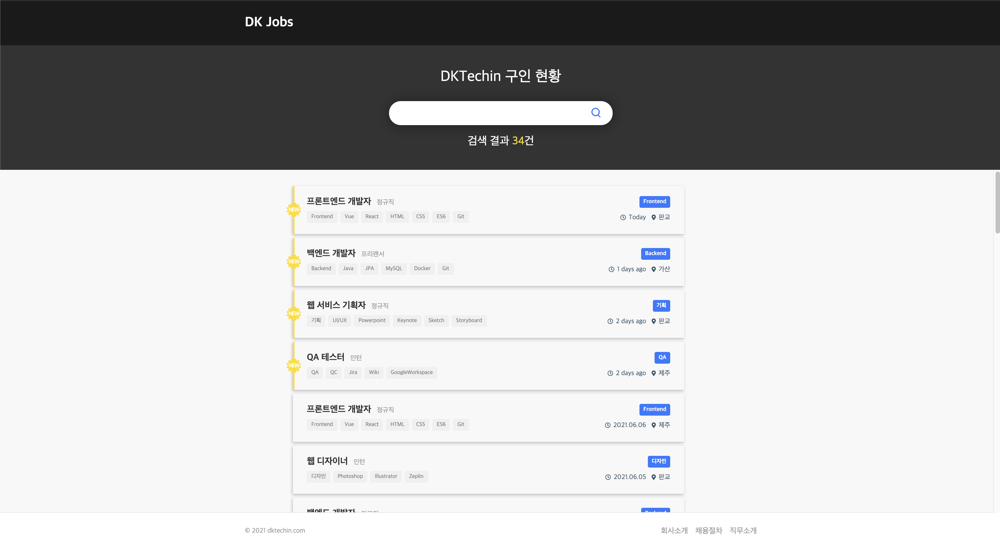
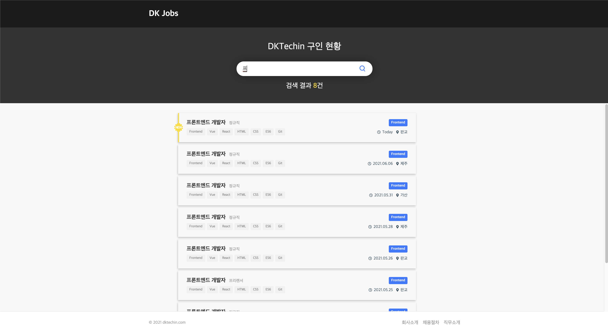
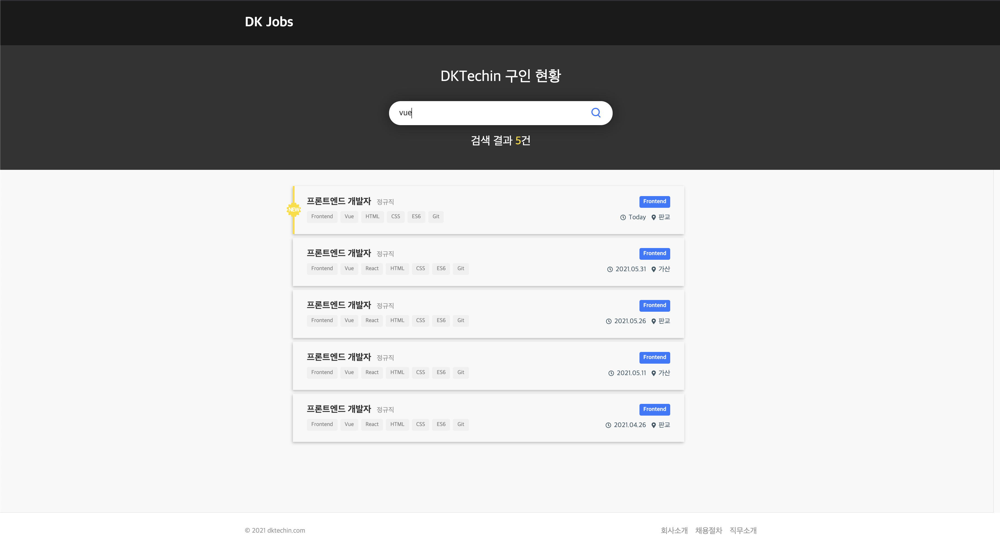

# dktechin > Front-end 코딩테스트

## ✔ 안내
코딩테스트 진행을 위해 제공된 소스의 기본 정보를 설명합니다.

### 소스 구조
아래의 소스 구조를 확인해주세요.
```
├── client            // 해당 영역에 환경 셋팅해서 작업
├── markup            // 마크업 html 및 css
|   ├── index.html      
|   └── style.css  
├── result            // 결과화면 이미지 파일 폴더
├── server            // API 제공을 위한 nodeJS 기반 서버
└── README.md         // 테스트 진행을 위한 안내사항 
```

### API 서버
front-end 개발시 API 연계를 위해 로컬환경에서 구동가능한 mock server(이하 'API 서버') 를 제공하였습니다.<br>
해당 서버의 API를 이용(연동)하여 개발을 진행주세요.

#### API 서버 > 버전 정보 (최소 요구 사항)
- `node` : `v11.0.0` 이상
- `npm` : `v6.4.1` 이상

#### API 서버 > 설치 및 실행 방법
- `/server` 디렉토리 위치에서 아래 명령어를 실행하여 node 모듈을 설치합니다.
  ```
  $ cd server
  $ npm install
  ```
- node 모듈 설치가 완료되면, 아래 명령어로 API 서버를 실행합니다.
  ```
  $ npm run demo
  ```
- http://localhost:3001 로 접속하여 API 확인이 가능합니다.
  

## ✔ 요구 사항
아래 구현 요구사항을 확인하시고, 알맞게 개발을 진행해 주세요.

### 요구 사항 > 일반
- `/client` 디렉토리 내에 작업되어야 합니다.
- `Vue`(`nuxt`) 또는 `React`(`next`) 를 이용하여 개발합니다. (SPA 활용 경험이 없다면 `VanillaJS` 사용)
- front-end 로컬 서버는 실행 포트를 `4000` 으로 설정하여 확인 할 수 있도록 구성해 주세요.
- `/markup` 디렉토리의 `index.html`, `style.css` 를 기본으로 하여 아래 결과 화면과 동일하게 구현해 주세요.
  

### 요구 사항 > 기능
- 영역 별로 적절하게 컴포넌트화를 진행해 주세요. (header, footer 등..)
- 제공된 API (`GET /rest/v1/jobs`) 를 통해 불러온 데이터를 등록일(createdAt) 최신순으로 정렬합니다.
- 오늘 날짜 기준으로 등록일(createdAt)이 2일내 라면 new 데이터로 표시합니다.
  - 당일일 경우 'Today'
  - 2일 내 데이터는 '${diff} days ago'
  - 그 외는 'YYYY.MM.DD' 포맷으로 출력합니다.
- 주어진 검색 인풋 박스에 대해 입력된 문자로 실시간 검색하는 기능을 구현합니다. (타이틀 또는 키워드에 입력된 검색어 포함)
  - 검색어 입력 즉시 필터링 되도록 합니다. (엔터 또는 검색버튼 클릭 없이)
    
    
- 실행 중 일어날 수 있는 오류에 대한 예외 처리를 해주셔야 합니다.
- 코드 작성 시, `ECMAScript6+` 스펙을 적극적으로 활용하는 것을 권장합니다.

### 요구 사항 > 문서화
- `/client/README.md` 파일 작성하기
  - 작업을 완료하신 후 `/client` 디렉토리 하위에 `README.md` 파일을 생성해두었으니 이곳에 작업 내역에 대한 상세한 설명을 담아주세요.
  - 내용의 형태는 자유롭게 작성해 주시면 됩니다. (마크다운 권장)
  - 프로그램 실행을 위해 별도 추가한 라이브러리가 있다면 설명과 버전 정보를 명시해 주세요.

## ✔ 결과 회신
- 수행 결과물은 메일발송일로 부터 1주일의 기한시까지 회신 되어야합니다.
- 수행 결과물은 지원자의 이름으로 압축하여 업로드 해주세요. (e.g. `홍길동.zip`)

---

> 📢 코딩테스트와 관련하여 문의가 필요한 경우 인사담당자에게 연락 주시면 됩니다.